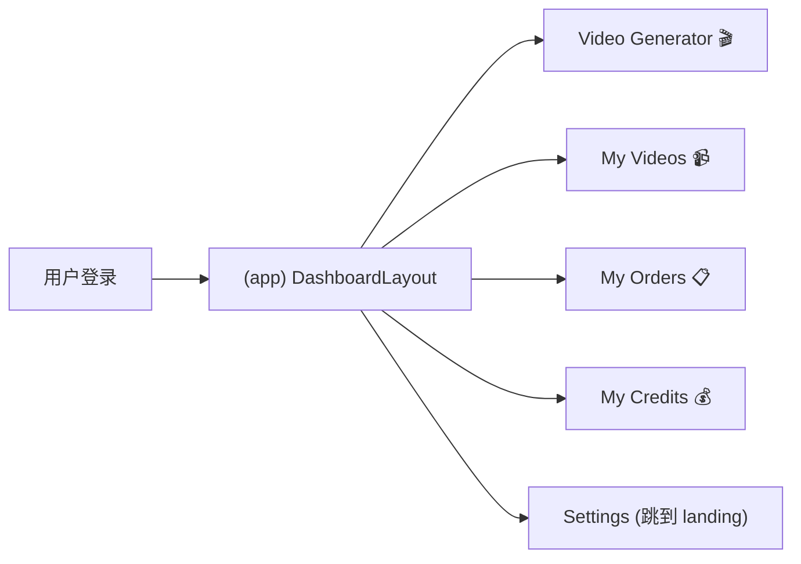
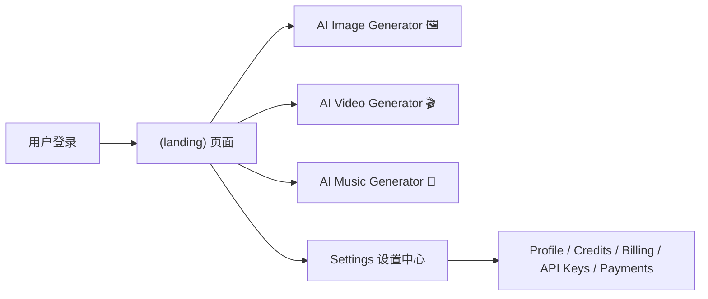

# bananapro-org vs motioncontrolai-video 全面对比分析

## 总结论：你的项目（bananapro-org）整体更强

> [!IMPORTANT]
> 你的 `bananapro-org` 是**基于 ShipAny 2 最新版本开发**的，同行的 `motioncontrolai-video` 则是基于**旧版 ShipAny 2 魔改**的。在用户中心和后台管理的架构成熟度上，你的项目**全面领先**。

**简要结论：你的 `bananapro-org` 整体更强。** 具体来说：

- **用户中心**：你的 Credits、Payments 页面使用统一的 Block 系统（PanelCard + TableCard），有分页、有筛选，远超对手那种手写 Table 的做法。
- **代码质量**：你全面使用 Block 组件 + i18n，对手在 App 侧大量硬编码英文文字和原生 Table。
- **生成器**：你的 image.tsx 有 39KB，功能比对手的 28KB 更丰富。

**只有 2 点值得借鉴：**
1. **「我的作品」页面** —— 对手有一个 `My Videos` 网格画廊（VideoCard + 分页 + 删除），你目前缺少类似的"历史生成作品管理"页面，这个优先级最高。
2. **Admin Dashboard 统计面板** —— 对手有 `admin/dashboard` 和 `admin/feedbacks`，对运营分析有帮助。

---

## 一、用户中心（Settings）对比

两个项目的设置中心路由都位于 `/settings` 下，但功能完备性差距明显。

| 功能模块 | bananapro-org | motioncontrolai-video | 优势方 |
|---------|:---:|:---:|:---:|
| 个人资料 (Profile) | ✅ FormCard 驱动 | ✅ 同样的 FormCard | **平手** |
| 安全设置 (Security) | ✅ 密码重置 + 删除账号 | ✅ 完全一样 | **平手** |
| 账单管理 (Billing) | ✅ PanelCard + TableCard + 多 Tab 筛选 | ✅ 完全一样 | **平手** |
| 积分管理 (Credits) | ✅ **PanelCard 余额展示 + TableCard 带 Tab 筛选 (grant/consume) + 分页** | ❌ 无独立页面 | **🏆 你赢** |
| 支付记录 (Payments) | ✅ **完整的订单表格，含一次性/订阅/续费筛选，支持发票跳转** | ❌ 无独立页面 | **🏆 你赢** |
| API Key 管理 | ✅ **TableCard + 创建/编辑/删除完整 CRUD** | ✅ 同样的实现 | **平手** |
| 发票管理 (Invoices) | ✅ 有 retrieve 路由 | ✅ 有 retrieve 路由 | **平手** |

> [!TIP]
> 你的 `/settings/credits` 页面非常完善——有**剩余额度展示**、**grant/consume Tab 筛选**和**分页**。而对手只有一个简陋的 `my-credits` 页面（在 App 侧边栏下），直接用原生 Table 手写，**没有分页、没有筛选、没有 PanelCard**。

---

## 二、App 仪表板（Dashboard）对比

这是对手**做得比较有特色**的地方，但也有明显的不足。

| 功能 | bananapro-org | motioncontrolai-video | 优势方 |
|-----|:---:|:---:|:---:|
| 工具区布局 | Landing Page 内嵌 `(ai)` 路由组 | 独立 `(app)` 路由组 + Sidebar | **对手稍好** |
| AI 生成器 | ✅ image + video + music（`39KB` image.tsx） | ✅ image + video + music（`28KB` image.tsx） | **🏆 你的更丰富** |
| 作品管理 (My Videos) | ❌ 无独立作品库页面 | ✅ **VideoCard 网格布局 + 分页 + 删除回调** | **对手赢** |
| 我的订单 (My Orders) | ✅ 在 settings/payments 更完善 | ⚠️ 在 app 里，手写 Table、无分页 | **🏆 你赢** |
| 我的积分 (My Credits) | ✅ 在 settings/credits 更完善 | ⚠️ 在 app 里，手写 Table、无分页 | **🏆 你赢** |

> [!NOTE]
> **对手的「My Videos」作品库是值得学习的亮点。** 它有：
> - `VideoCard` 组件：卡片网格展示，含缩略图预览
> - 客户端 API 分页：`POST /api/video/my-videos` 
> - 删除后自动重算分页，自动跳转
> - 完善的空状态和错误状态处理
> 
> 你的项目目前**没有类似的"我的生成作品"页面**，这是最大的功能缺口。

---

## 三、代码质量对比

| 维度 | bananapro-org | motioncontrolai-video | 评价 |
|-----|:---:|:---:|:---:|
| Block 复用系统 | ✅ 完整（FormCard, TableCard, PanelCard, ConsoleLayout） | ⚠️ **settings 用了同样的 Block，但 App 侧大量手写** | **🏆 你更一致** |
| 订单/积分页面 | ✅ 全部用 TableCard 统一 | ❌ my-orders / my-credits 用原生 Table 硬编码 | **🏆 你更优雅** |
| Sidebar User 组件 | ✅ 完整 hydration 修复 + Google One Tap | ✅ 完全一样 | **平手** |
| i18n 一致性 | ✅ 全部使用 next-intl | ⚠️ 部分页面硬编码英文（如 "My Videos", "Loading..."） | **🏆 你更规范** |
| 分页实现 | ✅ 服务端分页（searchParams） | ⚠️ 混合模式（settings 服务端，app 客户端 fetch） | **你更统一** |

---

## 四、对手的 App 侧边栏 Dashboard 示意图

对手的 `(app)` 路由组多了一个独立的带侧边栏的"用户工作台"概念：

而你的项目把工具直接放在 Landing 页面下：

---

## 五、后台管理（Admin）对比

| 模块 | bananapro-org | motioncontrolai-video |
|-----|:---:|:---:|
| 用户管理 | ✅ | ✅ |
| 支付管理 | ✅ | ✅ |
| 订阅管理 | ✅ | ✅ |
| 积分管理 | ✅ | ✅ |
| API 密钥 | ✅ | ✅ |
| 文章管理 (Posts) | ✅ | ✅ |
| 分类管理 | ✅ | ✅ |
| 权限管理 | ✅ | ✅ |
| 角色管理 | ✅ | ✅ |
| AI 任务 | ✅ | ✅ |
| 聊天管理 | ✅ | ✅ |
| **Showcases** | ✅ | ❌ |
| **Prompts 管理** | ✅ | ❌ |
| **Feedback** | ❌ | ✅ |
| **仪表板 Dashboard** | ❌ | ✅ |

> [!NOTE]
> 你多了 `showcases` 和 `prompts` 管理，对手多了 `feedbacks` 和 `dashboard` 统计面板。后者对运营分析比较有用。

---

## 六、核心结论与建议

### ✅ 你的优势（保持）
1. **用户中心更完善**：Credits 用 PanelCard + TableCard，Payments 有完整的筛选和发票入口
2. **代码一致性更强**：全部使用 Block 系统，无手写 Table 的"技术债"
3. **i18n 更规范**：没有硬编码文字
4. **生成器功能更丰富**：image.tsx 有 39KB vs 对手 28KB

### ⚠️ 可以向对手学习的（2 点）

#### 1. 「我的作品」页面（优先级：高）
> 添加一个 `/app/my-generations` 或 `/settings/generations` 页面，让用户可以浏览、管理、下载自己历史生成的图片/视频/音乐。对手的 `VideoCard` 网格 + 分页 + 删除是很好的参考。

#### 2. Admin 数据面板（优先级：中）
> 对手有一个 `admin/dashboard` 和 `admin/feedbacks`，用于查看整体统计和用户反馈。这对上线后的运营分析非常有用。

### ❌ 对手的弱点（你不需要学）
- `my-orders` / `my-credits` 用原生 Table 硬编码，无分页，无筛选——**你的 settings 页面已经远超它**
- 部分 UI 文本硬编码英文——**不够国际化**
- App 和 Settings 两套"用户中心"信息重复——**架构上不够清晰**

-------------
## gpt4 评价
**结论**
对方这版值得学的，不是“用户中心某个页面做得多高级”，而是把登录后体验从“设置页”变成了“工作台”。你这版底层能力其实更强，尤其账单、支付、订阅这块；他那版更强的是包装和路径设计。

**值得学**
- 独立的 `/app` 工作台很对路，左侧把“生成器 / 我的作品 / 订单 / 积分”串成一条主路径，用户一登录就知道下一步去哪。[对方 App Layout](</d:/project3/motioncontrolai-video/src/app/[locale]/(app)/layout.tsx:27>)
- 头像下拉里把第一入口直接指向“个人中心”，而不是 profile 资料页，这个转化更顺。[对方用户菜单](</d:/project3/motioncontrolai-video/src/shared/blocks/sign/sign-user.tsx:169>)
- “My Videos” 用卡片流展示资产，比表格更像创作产品；而且有分页、空状态、删除后回退页码，体验完整。[对方我的视频](</d:/project3/motioncontrolai-video/src/app/[locale]/(app)/app/my-videos/page.tsx:145>)
- 作品卡片上直接给下载、分享、删除，状态也可视化，这个很适合 AI 生成类产品。[对方视频卡片](</d:/project3/motioncontrolai-video/src/shared/components/blocks/video-card/index.tsx:88>)
- 积分页把“剩余积分 + 充值按钮”顶到最前面，离创作路径很近，商业转化是对的。[对方我的积分](</d:/project3/motioncontrolai-video/src/app/[locale]/(app)/app/my-credits/page.tsx:33>)
- 订单页做得很轻，普通用户能一眼看懂，不像后台报表。[对方我的订单](</d:/d:/project3/motioncontrolai-video/src/app/[locale]/(app)/app/my-orders/page.tsx:31>)

**不用照搬**
- 你这版的 `settings` 账务体系明显更成熟，订阅状态、周期、取消、发票、支付类型都更完整。[你的 Billing](</d:/project3/shipany-2/bananapro-org/src/app/[locale]/(landing)/settings/billing/page.tsx:35>) [你的 Payments](</d:/project3/shipany-2/bananapro-org/src/app/[locale]/(landing)/settings/payments/page.tsx:32>) [你的 Credits](</d:/project3/shipany-2/bananapro-org/src/app/[locale]/(landing)/settings/credits/page.tsx:34>)
- 你这边还有更好的通用组件抽象，`PanelCard` / `TableCard` 已经能稳定承载这些后台型页面，对方很多页其实是手搓的轻封装。[你的 TableCard](</d:/project3/shipany-2/bananapro-org/src/shared/blocks/table/table-card.tsx:22>) [你的 PanelCard](</d:/project3/shipany-2/bananapro-org/src/shared/blocks/panel/panel-card.tsx:19>)
- 对方不少实现是“产品包装优先”，工程一致性一般，比如大量页面是定制写法、客户端拉取、还有注释编码问题，不是特别值得原样抄。

**你这版最该怎么学**
- 不要推翻 `settings`，它继续做“账户/账单/支付/API Key”。
- 新增一个 `/app` 或 `/workspace`，专门承接“创作台 / 我的作品 / 积分 / 订单”。
- 你其实已经有半套现成结构了：`/activity` 和 `/settings` 已经分开，只是入口不够强，页面形态也偏管理台。[你的 Activity Layout](</d:/project3/shipany-2/bananapro-org/src/app/[locale]/(landing)/activity/layout.tsx:11>) [你的 AI Tasks](</d:/project3/shipany-2/bananapro-org/src/app/[locale]/(landing)/activity/ai-tasks/page.tsx:27>) [你的 Settings Sidebar](</d:/project3/shipany-2/bananapro-org/src/config/locale/messages/zh/settings/sidebar.json:2>)
- 你最小改法甚至不用重做数据层：先把头像菜单的默认入口从 `/settings/profile` 改成 `/activity/ai-tasks` 或新 `/app`，再把 `ai-tasks` 从表格改成卡片化“我的作品”。[你当前用户菜单](</d:/project3/shipany-2/bananapro-org/src/shared/blocks/sign/sign-user.tsx:167>)

一句话总结：他们赢在“把用户中心产品化了”，你赢在“后台和账务底座更完整”。最值得学的是 `/app` 工作台这层壳，不是把你现有 `settings` 全部换掉。

如果你要，我下一步可以直接在你这个仓库里给你出一版 `/app` 信息架构和落地改造清单，或者直接先把骨架搭出来。

### 改造复杂么，会容易出错么，gpt 4回复
不算特别复杂，但有两种复杂度，差别很大。

如果你只是做“产品层改造”，风险其实可控：
- 新增一个 `/app` 或 `/workspace` 壳子
- 把现有 `activity / settings / create` 里的能力重新编排
- 增加统一侧边栏、默认登录后跳转、头像菜单入口
- 把“我的作品/积分/订单”做成更像用户中心的页面

这种改造本质上是“重组前台路由和页面表现”，数据层大多复用你现有的 `credits / payments / billing / ai tasks`。工作量中等，容易出错的点主要是路由跳转、鉴权、国际化文案、以及不同页面之间入口不一致，但不属于高风险重构。

真正容易出错的是另一种：你如果想把它改成“底层也统一”的大手术，就会明显复杂很多：
- 把 `activity` 的任务历史、`settings` 的账单支付、生成页的积分提示，全部并到一套新模型里
- 同时改支付回跳、订阅管理、积分消费展示、作品历史结构
- 再顺手统一组件、状态管理、文案和导航

这类改动最容易引入行为回归，尤其是：
- 支付成功后的回跳页
- 登录后跳转和未登录拦截
- 多语言路径和文案 key
- 积分显示不一致
- 作品历史与任务历史口径不一致
- 旧入口失效导致 SEO 或用户收藏链接失效

所以我的判断很直接：
- 小改版，不复杂，风险中低
- 中改版，可做，风险可控，但要分阶段
- 大一统重构，复杂，容易出错

我建议你走“渐进式”：
1. 先加 `/app` 壳子，只做导航和入口重组。
2. 第一批只接入 `我的作品 / 积分 / 订单`。
3. `settings` 保留为账户与账务后台，不动支付底层。
4. 跑顺后，再考虑把 `activity` 内容逐步并进去。

这样出错概率会低很多，因为你不是“替换旧系统”，而是“在旧系统上加一层更像产品的前台壳”。

如果你愿意，我下一条可以直接跟你拆：
- 哪些属于“低风险先做”
- 哪些属于“高风险暂时别碰”
- 粗略工期大概几天到几天